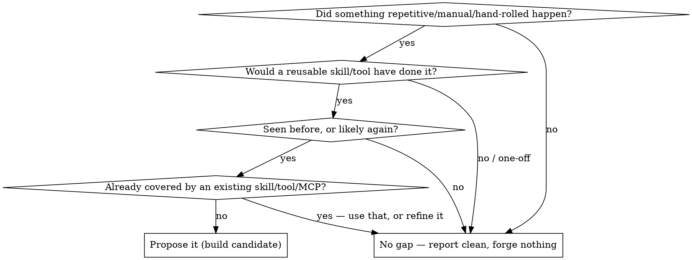

# Skill-Forge

Turn a session's capability gaps into reusable skills/tools, then keep them sharp with real usage. This skill **proposes**; the maintainer **disposes** on any build or retire. It never force-builds a skill to look productive — most scans should surface **zero** gaps, and that is the correct, healthy outcome. Skill sprawl is the failure mode this guards against.

**Kill switch:** if `~/.claude/.forge-off` exists, decline — do nothing, say the forge is off.

**Not the same loop as your lessons-capture step.** A lessons loop captures *lessons* (what we learned) → a lessons doc (e.g. `docs/solutions/` or a `LESSONS.md`). Skill-forge builds *capabilities* (a thing that does work) → a skill/tool + a ledger entry. If the takeaway is "remember to do X," that is a lesson (your lessons-capture step). If it is "I kept doing X by hand and want a reusable doer," that is a forge candidate.

## Modes

Pick the mode from how you were invoked. State which mode you're in.

### scan — detect gaps (wrap-up / on request)

Look back over the session (and, at wrap-up, the recent session history) for a **genuine, recurring** capability gap. Filter hard:

Gap signals: the same multi-step ritual done by hand more than once; a hand-rolled `curl`/script against an API with no clean tool; a workflow where you had to remember a fragile sequence; "I wish there were a skill for this." Before proposing, check the existing skills list and MCP surface — if one already covers it, use or **refine** it instead of forging a duplicate.

Output: for each candidate — **gap** (one line), **what the skill/tool would do**, **kind** (skill/tool/command), **why existing tools don't cover it**. If none survive the filter, say "no forge candidate this session" — and when notable near-misses were rejected, name each in one line with the test it failed (this shows the filter ran, not that the scan was skipped). Then stop. Do **not** build without the maintainer's go-ahead.

### build — forge an accepted candidate

**REQUIRED SUB-SKILL:** use `writing-skills` for authoring (frontmatter = `name` + `description`; description is **triggering conditions only**, never a workflow summary; keyword-rich for discovery). For a tool/CLI over an external API, prefer your CLI-generation tool of choice (e.g. an API-CLI generator) first.

1. Build the skill/tool per writing-skills. The `description` is the load-bearing discoverability mechanism (it decides whether the skill is invoked in future) — make it match how the scenario will actually surface.
2. Register it: append one line to `~/.claude/skill-forge/ledger.jsonl` with `name, kind, path, gap, created, last_refined, refine_threshold (default 3), status:"active"`. **Do not author the date yourself** — shell out: `date +%F`.
3. Functional smoke test: exercise it once (or a subagent application-scenario test) and confirm it does the thing. Report what you verified.

### refine — improve a skill from real usage

Triggered when a forged skill's counter reaches its `refine_threshold` (the usage hook nudges), or on request.

1. Read `~/.claude/skill-forge/usage.jsonl` filtered to that skill, plus the skill's own file, to see how it's actually been invoked and where it was awkward or missed.
2. Improve the weakest thing: sharpen the `description` if it wasn't auto-invoking; fix steps that misfired; add a real rationalization/mistake seen in use; cut dead weight. Small, evidence-driven edits — not a rewrite.
3. Reset the counter and stamp the refine: `printf 0 > ~/.claude/skill-forge/counts/<name>` and update that ledger line's `last_refined` to `date +%F`. Append a `{"event":"refined"}` line to `usage.jsonl`.
4. If a skill is used near-zero over a long window, or a scan found it obsolete, propose **retire** (set `status:"retired"`, note why) — surface for sign-off, don't retire silently.

### status — list the forge

Read `ledger.jsonl` + `counts/`. Print each active forged skill: name, uses-since-refine, refine_threshold, due-for-refine? Note the kill-switch state.

## Interplay with the hooks

- `skill-forge-usage.sh` (PostToolUse on `Skill`) increments `counts/<name>` and nudges at threshold. You don't call it — it feeds you.
- `skill-forge-status.sh` (SessionStart) surfaces active forged skills + refine-due, so they stay top-of-mind. Silent when the ledger is empty.
- Your session-wrap-up command/ritual should carry a scan step — that is the canonical wrap-up trigger (see the install notes for wiring it, including the requirement that the scan be invoked *through the `Skill` tool* so the usage hook can count it).

## Common mistakes

| Mistake | Fix |
|---|---|
| Forging a skill to prove the loop works | Most scans → zero. Report clean. Sprawl is the failure mode. |
| Description summarizes the workflow | Triggers only — a workflow summary makes future-you skip the body (writing-skills CSO). |
| Duplicating an existing skill/MCP | Check the skills list first; refine the existing one instead. |
| Authoring dates/counters by hand | Shell to `date +%F`; let the hook own the counter. |
| Rewriting a skill on refine | Evidence-driven small edits from `usage.jsonl`, not a rewrite. |
